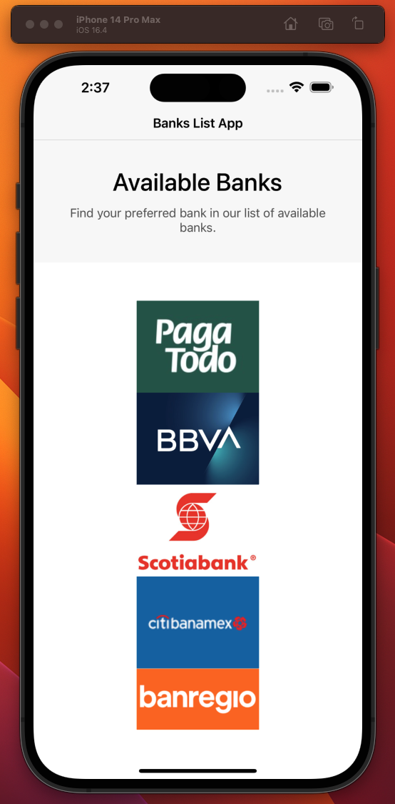
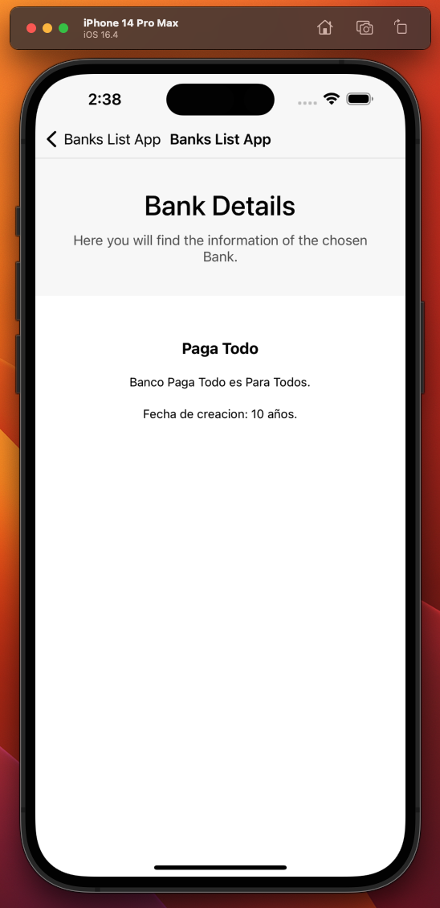

# BANKSLIST

Esta es una aplicación de ejemplo de React Native que muestra una lista de bancos en la pantalla principal y los detalles del banco seleccionado, en la segunda pantalla.

Esta aplicación debe descargar la información de del API https://dev.obtenmas.com/catom/api/challenge/banks, al iniciar y darle al usuario la opción de cual banco quiere ver la informacion detallada.

# Instalación

1. Clona este repositorio en tu computadora local.
2. Debes asegurarte de configurar el entorno de desarrollo segun las instrucciones aqui [react native enviroment setup](https://reactnative.dev/docs/environment-setup)
3. En la terminal, navega hasta el directorio del proyecto y ejecuta el comando **npm install** para instalar todas las dependencias necesarias.
4. Para ios, enavega hasta el directorio de ios, y ejecuta el comando `bundle exec pod install`.

# Uso

1. En la terminal, navega hasta el directorio del proyecto y ejecuta el comando **npm start** para iniciar el servidor de desarrollo.
2. En otra terminal, ejecuta el comando **npm run ios** o **npm run android** para iniciar la aplicación en el emulador o dispositivo correspondiente.

# Características

La pantalla principal muestra una lista bancos obtenidos de un endpoint.

Cada banco se muestra con el logo como un botón que lleva a la pantalla de detalles correspondiente.

La pantalla de detalles muestra la informacion del banco seleccionado.

# Contribución

Si deseas contribuir a este proyecto, sigue los siguientes pasos:

1. Haz un fork de este repositorio.
2. Crea una nueva rama en tu fork con tu nueva funcionalidad o corrección de errores.
3. Envía una solicitud de extracción a este repositorio para que podamos revisar tus cambios.

# Licencia

Este proyecto está bajo la licencia MIT. Puedes ver el archivo de licencia en el repositorio.
